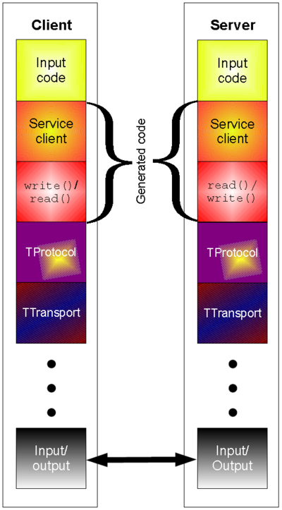

# Learning Thrift

>   学习 `Thrift` 示例及笔记，部分资料来源于网络，整理过来仅供参考使用。


### 简介

`Thrift` 源于 `facebook` ，2007 年 `facebook` 提交 `Apache` 基金会将 `Thrift` 作为一个开源项目。`Facebook` 创造 `Thrift` 的目的是为了解决 `facebook` 系统中各系统间大数据量的传输通信以及系统间语言环境不同需要跨平台的问题。

`Apache Thrift` 是 `Facebook` 实现的一种高效的、支持多种编程语言（IDL）的远程服务调用框架，包括一个软件库和一组代码生成工具，以加快高效率、可扩展的后端服务的开发与实现的速度。它采用接口描述语言定义并创建服务，支持可扩展的跨语言服务开发，它的代码生成器引擎可以在多种语言中，如 `C++/Java/Python/PHP/Ruby/Erlang/Perl/Haskell/C#/Cocoa/Smalltalk` 等创建高效的、无缝的服务，传输数据格式采用二进制格式，相对于 `JSON` 和 `XML` 体积更小，对于高并发、大数据量和多语言的环境更有优势。

它把各语言中最常用的部分加以抽象，把它们放进一个通用库里，再用各个语言实现，来实现跨编程语言的高效而可靠的通信。亦即，`Thrift` 允许开发者在一个单独的语言无关的文件里（IDL文件），定义数据类型和服务接口，然后生成用来构建 `RPC` 客户和服务器所需的全部代码。

`Thrift` 服务器包含用于绑定协议和传输层的基础架构，它提供阻塞、非阻塞、单线程和多线程的模式运行在服务器上，可以配合服务器/容器一起运行，可以和现有的J2EE服务器/WEB容器无缝结合。

跨语言支持：`Thrift` 可以通过代码生成工具将接口定义文件生成不同语言的服务器端和客户端代码，从而实现服务器端和客户端的跨语言支持。用户在 `thrift` 定义文件中声明服务，这些服务通过编译生成相应语言的代码文件，然后用户实现服务（客户端调用服务，服务器端提供服务）。其中 `Protocol`（协议层，定义数据的传输格式）和 `Transport`（传输层，定义数据传输方式）被用作运行时库。


优点：

1. 支持多种编程语言：`C++/Java/Python/PHP/Ruby/Erlang/Perl/Haskell/C#/Cocoa/Smalltalk` 等；
2. 在多种不同的语言之间通信，`thrift` 可以作为二进制的高性能的通讯中间件，支持数据（对象）序列化和多种类型的 `RPC` 服务；
3. `Thrift` 适用于搭建大型数据交换及存储的通用工具，对于大型系统中的内部数据传输相对于 `JSON` 和 `xml` 无论在性能、传输大小上有明显的优势。

缺点：

`Thrift` 适用于程序对程序静态的数据交换，需要先确定好它的数据结构，它是完全静态化的，当数据结构发生变化时，必须重新编辑 `IDL` 文件，代码生成，再编译载入的流程。

### 安装

参考官方文档来安装，这里主要给出 `Ubuntu` 下的安装办法，笔者操作系统版本为 `16.04 LTS` ，其它相异环境请自行测试。

```bash
# 安装依赖
# https://thrift.apache.org/docs/install/debian 原文档使用中使用的某些依赖版本过旧（可能文件链接已经404），这里修正使用了当前较新的版本
sudo apt-get install automake bison flex g++ git libboost-all-dev libevent-dev libssl-dev libtool make pkg-config
wget http://ftp.debian.org/debian/pool/main/a/automake-1.16/automake_1.16.1-4_all.deb
sudo dpkg -i automake_1.16.1-4_all.deb

wget https://dl.bintray.com/boostorg/release/1.69.0/source/boost_1_69_0.tar.gz
tar xvf boost_1_69_0.tar.gz
cd boost_1_69_0
./bootstrap.sh
sudo ./b2 install

# 安装Thrift
# https://thrift.apache.org/docs/BuildingFromSource 
# http://www.apache.org/dyn/closer.cgi?path=/thrift/0.11.0/thrift-0.11.0.tar.gz 从官网找到离你最近的下载源，因为笔者位于上海，下面示例使用了上海大学的源
wget http://mirrors.shu.edu.cn/apache/thrift/0.11.0/thrift-0.11.0.tar.gz
tar xvf thrift-0.11.0.tar.gz
cd thrift-0.11.0
./bootstrap.sh
./configure
make
make check
make install
# 下面命令如正常回显版本号即代表安装好了
thrift --version
```

### 技术要领

#### 1. 整体架构



>   顶部的黄色部分（`Input Code`）是在 `Thrift` 定义文件中，用户实现的业务逻辑代码；橙色部分（`ServiceClient`）是根据 `Thrift` 定义的服务接口描述文件生成的客户端和服务器端代码框架；红色部分（`write()/read()` 或 `read()/write()`）是根据 `Thrift` 文件生成代码实现数据的读写操作；红色部分以下是 `Thrift` 的协议、传输体系以及底层 `I/O` 通信，使用 `Thrift` 可以很方便的定义一个服务并且选择不同的传输协议和传输层而不用重新生成代码。

#### 2. 类型

- Base Types：基本类型，如 bool、byte、i16、i32、i64、double、string 等
- Struct：结构体类型
- Container：容器类型，即List、Set、Map
- Exception：异常类型
- Service：定义对象的接口和一系列方法

#### 3. 协议

Thrift 可以让用户选择客户端与服务端之间传输通信协议的类别，在传输协议上总体划分为文本 (text) 和二进制 (binary) 传输协议，为节约带宽，提高传输效率，一般情况下使用二进制类型的传输协议为多数，有时还会使用基于文本类型的协议，这需要根据项目 / 产品中的实际需求。常用协议有以下几种：

- TBinaryProtocol —— 二进制编码格式进行数据传输
- TCompactProtocol —— 高效率的、密集的二进制编码格式进行数据传输
- TJSONProtocol —— 使用 JSON 的数据编码协议进行数据传输
- TSimpleJSONProtocol —— 只提供 JSON 只写的协议，适用于通过脚本语言解析

#### 4. 传输层

常用的传输层有以下几种：

1. TSocket：使用阻塞式I/O进行传输，是最常见的模式；
2. TFramedTransport：使用非阻塞方式，按块的大小进行传输，要求服务器为非阻塞类型；
3. TNonblockingTransport：使用非阻塞方式，用于构建异步客户端。

#### 5. 服务端类型

常见的服务端类型有以下几种：

1. TSimpleServer —— 单线程服务器端使用标准的阻塞式 I/O
2. TThreadPoolServer —— 多线程服务器端使用标准的阻塞式 I/O
3. TNonblockingServer —— 多线程服务器端使用非阻塞式 I/O

### 示例

#### Ping

>   本示例参考了 [bayandin/thrift-examples](https://github.com/bayandin/thrift-examples) ，并做些改动。

编写 `ping.thrift` 文件

```thrift
service PingService {
    string ping(),
    void say(1:string msg)
}
```

生成 `python` 语言代码

```bash
thrift -out pygen/ --gen py ping.thrift
```

编写 `server.py` 代码：

```python
#!/usr/bin/env python

from thrift.transport import TSocket
from thrift.transport import TTransport
from thrift.protocol import TBinaryProtocol
from thrift.server import TServer

from pygen.ping import PingService


class PingServiceHandler:
    def __init__(self):
        self.log = {}

    def ping(self):
        return 'pong'

    def say(self, msg):
        print(msg)


handler = PingServiceHandler()
processor = PingService.Processor(handler)
transport = TSocket.TServerSocket(port=9090)
tfactory = TTransport.TBufferedTransportFactory()
pfactory = TBinaryProtocol.TBinaryProtocolFactory()

server = TServer.TSimpleServer(processor, transport, tfactory, pfactory)

print('Starting python server...')
server.serve()
print('done!')
```

编写 `client.py` 代码：

```python
#!/usr/bin/env python

import sys
sys.path.append('./pygen')

from thrift import Thrift
from thrift.transport import TSocket
from thrift.transport import TTransport
from thrift.protocol import TBinaryProtocol

from pygen.ping import PingService

try:

    # Make socket
    transport = TSocket.TSocket('localhost', 9090)

    # Buffering is critical. Raw sockets are very slow
    transport = TTransport.TBufferedTransport(transport)

    # Wrap in a protocol
    protocol = TBinaryProtocol.TBinaryProtocol(transport)

    # Create a client to use the protocol encoder
    client = PingService.Client(protocol)

    # Connect!
    transport.open()
    print(client.ping())
    client.say('Hello form python!')

    # Close!
    transport.close()

except Thrift.TException, tx:
    print '%s' % (tx.message)
```

运行：

```bash
chmod +x server.py client.py
# terminal#1
./servcer.py
# You will see
# Starting python server...
# terminal#2
./client.py
# pong
```

### 参考资源

- [官方网站](https://thrift.apache.org/)
- [维基百科](https://zh.wikipedia.org/wiki/Thrift)
- [Thrift: The Missing Guide](http://diwakergupta.github.io/thrift-missing-guide/)
- [Apache Thrift - 可伸缩的跨语言服务开发框架](https://www.ibm.com/developerworks/cn/java/j-lo-apachethrift/index.html)
- [Thrift简介及实例应用](https://blog.csdn.net/xyw_blog/article/details/8950140 )
- [Thrift Tutorial](https://thrift-tutorial.readthedocs.io/en/latest/intro.html)